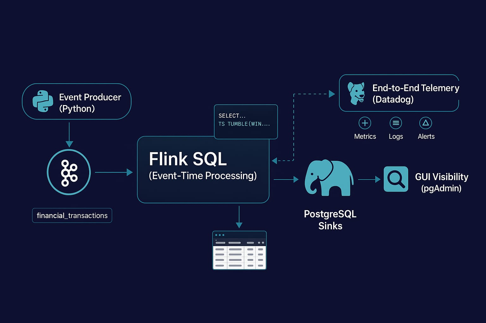

# Kafka Commerce Project
This project demonstrates a production-style streaming data pipeline, outlining the reasoning behind each component. The workflow begins with an event producer written in Python, which sends data to Kafka. From there, **Flink SQL** performs event-time processing before the results are stored in PostgreSQL sinks. The processed data can be visualized through **pgAdmin**, while end-to-end telemetry and monitoring are handled by **Datadog**. The focus of this project is on the architecture and dataflow—tracing what happens to each event from ingestion to storage, how event time is managed, and how the overall system maintains **robustness** and **reliability**.

## Architecture at a glance


**High level flow:**
Producer (main.py) → Kafka topic (financial_transactions) → Flink SQL job (source + transforms) → JDBC sinks (transactions + aggregates) → Postgres

Runtime services (Docker):
- **broker:** Kafka in KRaft mode (single node) for local dev
- **jobmanager/taskmanager:** Flink cluster (1 JM, 1 TM) executing the SQL job
- **postgres + pgadmin:** storage and GUI for querying results
- **datadog-agent:** observability (agent collects container metrics/logs; postgres check enabled)

## Dataflow (end-to-end)

1) Producer emits a transaction JSON with `transactionDate` as an ISO-8601 string.
2) Kafka stores the event in `financial_transactions`topic.
3) Flink source reads JSON, computes `ts = TO_TIMESTAMP(transactionDate, ...)`, assigns event-time watermarks.
4) Flink writes:
    - Every event to `transactions` (raw history)
    - Aggregations to `sales_per_category`, `sales_per_day`, `sales_per_month`
5) Postgres exposes the results; pgAdmin shows tables auto-refreshing.
6) Datadog visualizes runtime health of the entire pipeline.


## Pipeline shape (SQL breakdown)

The SQL job (see `sql/pipeline.sql`) defines:
1) Source table (Kafka):
    - connector = kafka, format = json
    - event-time column `ts` computed from `transactionDate`
    - watermark on `ts`

2) Raw sink (JDBC → Postgres):
    - `transactions`: stores every ingested event with parsed timestamps

3) Aggregation sinks (JDBC → Postgres):
    - `sales_per_category`: GROUP BY category
    - `sales_per_day`: GROUP BY DATE(ts) as sale_day
    - `sales_per_month`: GROUP BY YEAR(ts), MONTH(ts) as year_num, month_num

4) Statement set executes multiple INSERTs atomically so the same source feeds all sinks.

Schema alignment matters: Sink DDLs in Postgres match the Flink sink schema exactly (column names/types) to avoid JDBC type errors I have used TIMESTAMP instead of TIMESTAMP_LTZ for Postgres.

##### **Postgres Database Images Via PgAdmin UI**
###### Overview

###### Raw Transactions data

###### Sales Per Category

## Connectors and classpath

Flink discovers connectors from its classpath:
- Connector jars are mounted into the containers under `/opt/flink/external-jars`.
- The cluster is configured to include both `/opt/flink/lib/*` and `/opt/flink/external-jars/*` in `FLINK_CLASSPATH` so SQL Client and runtime find the Kafka + JDBC connectors.
- If a “Could not find any factory for identifier 'kafka'” occurs, ensure the jars exist in the container and restart the JM/TM to reload classpath.

##### **Flink Web UI Images**
###### Overview

###### Flink Job


###### Sample Job


## Fault tolerance and recovery

Design choices made for stability during iteration:
- Event-time processing with watermarks prevents aggregation drift under delays.
- Statement set fan-out keeps sink writes in sync for a single source read.
- Postgres sink schemas are idempotent-friendly for replays (no synthetic upserts in this demo).
- Operationally, you can restart services and re-submit the SQL—Kafka retains the topic; Flink will reprocess from earliest (or committed offsets if configured).

## Observability

Datadog Agent runs as a sidecar to:
- Discover containers (Docker listener) and collect container metrics/logs when enabled.
- Scrape Postgres using auto-discovery labels on the `postgres` service.
- Notes applied here:
   - Postgres check disables WAL stat_io metrics for compatibility via a conf.d override.
   - API/site must be correct for the forwarder to be healthy.

pgAdmin is provided to visualize Postgres contents interactively. See `docs/PGADMIN_GUIDE.md` for details.
##### **Datadog Web UI Images**
###### Overview


###### Flink Task Mnagager Monitor

###### Monitor Graphs


## Repository structure (relevant parts)

- docker-compose.yml — Orchestrates Kafka, Flink, Postgres, pgAdmin, Datadog
- sql/
   - pipeline.sql — Flink SQL: source, sinks, and statement set
   - create_tables.sql — Postgres DDL matching sinks
- main.py — Sample event producer (ISO-8601 timestamps)
- flink-jars/ — Flink connectors (Kafka, JDBC)
- datadog/
   - conf.d/postgres.d/conf.yaml — Postgres check override
- docs/
   - PGADMIN_GUIDE.md — Connecting pgAdmin to Postgres
   - screenshots (Flink jobs, tables, graphs)

## Key takeaways

- Declare event time explicitly and watermark it—this stabilizes aggregations.
- Keep sink schemas aligned with JDBC types supported by the target (TIMESTAMP vs TIMESTAMP_LTZ).
- Put connector jars on Flink’s classpath for both SQL Client and runtime.
- Use statement sets to fan out to multiple sinks consistently.

## How to use it (Windows-friendly)

Prerequisites:
- Docker Desktop running
- Python 3.10+ with pip

1) Start core services
```powershell
docker compose up -d broker postgres pgadmin jobmanager taskmanager
```

2) Create Postgres tables (optional if you want to pre-provision)
```powershell
docker exec -i postgres psql -U postgres -d kafka_commerce -f /sql/create_tables.sql
```

3) Submit the Flink SQL pipeline
```powershell
docker exec -it flink-jobmanager /bin/bash -lc "/opt/flink/bin/sql-client.sh -f /opt/sql/pipeline.sql"
```

4) Produce sample data
```powershell
python -m pip install -r requirements.txt
python .\main.py
```
(Press Ctrl+C to stop the producer any time.)

5) Verify results
- Flink UI: http://localhost:8081 → check the job is RUNNING
- pgAdmin: http://localhost:5050 (email: admin@admin.com, pwd: admin)
    - Connect to host: postgres, db: kafka_commerce, user: postgres, pwd: password
    - Run quick checks:
        - SELECT COUNT(*) FROM transactions;
        - SELECT * FROM sales_per_category ORDER BY total_sales DESC LIMIT 10;

Optional: Start Datadog Agent
```powershell
docker compose up -d datadog
```
Set your own DD_API_KEY/DD_SITE in docker-compose.yml or via environment overrides if you plan to use Datadog.

